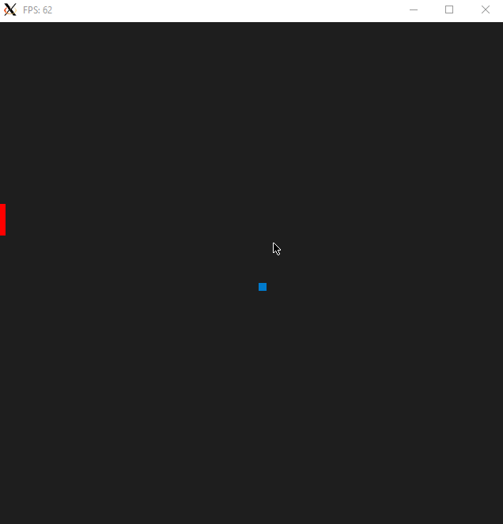
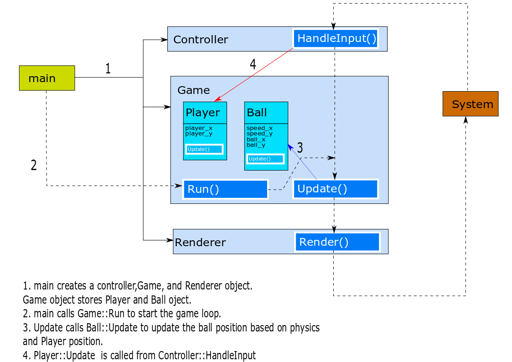

# CPPND: Capstone Pong Game

This is a repo for the Capstone project in the [Udacity C++ Nanodegree Program](https://www.udacity.com/course/c-plus-plus-nanodegree--nd213). The code for this repo, inspired by [this](https://codereview.stackexchange.com/questions/212296/snake-game-in-c-with-sdl) excellent StackOverflow post and set of responses, is given as a base code to understand and implement the project.

The project implements a pong game for a single player with the left boundary of the domain to be defended by the player using a paddle. When the ball hits the top, bottom or the right boundary the ball rebounds with same velocity components and only the sign of the x component changes when it hits the right boundary and the sign of the y component changes when it hits the top and bottom boundary. The changes in the velocity components when it hits the paddle is changes with the position of the paddle which comes in contact to the ball.

## Dependencies for Running Locally
* cmake >= 3.7
  * All OSes: [click here for installation instructions](https://cmake.org/install/)
* make >= 4.1 (Linux, Mac), 3.81 (Windows)
  * Linux: make is installed by default on most Linux distros
  * Mac: [install Xcode command line tools to get make](https://developer.apple.com/xcode/features/)
  * Windows: [Click here for installation instructions](http://gnuwin32.sourceforge.net/packages/make.htm)
* SDL2 >= 2.0
  * All installation instructions can be found [here](https://wiki.libsdl.org/Installation)
  * Note that for Linux, an `apt` or `apt-get` installation is preferred to building from source.
* gcc/g++ >= 5.4
  * Linux: gcc / g++ is installed by default on most Linux distros
  * Mac: same deal as make - [install Xcode command line tools](https://developer.apple.com/xcode/features/)
  * Windows: recommend using [MinGW](http://www.mingw.org/)

## Basic Build Instructions

1. Clone this repo.
2. Make a build directory in the top level directory: `mkdir build && cd build`
3. Compile: `cmake .. && make`
4. Run it: `./PongGame`.

## File and Class structure
The files and class structure is shown:

## Project Rubric Specifications met
The matched project rubric is shown as follows:

### Loops, Functions, I/O
| Criteria | Meets Specifications |
| -------- | -------------------- |
| The project demonstrates an understanding of C++ functions and control structures. | The project is organized into functions and control structures like Ball::Update() function (line 5 - 48) |

### Object Oriented Programming
| Criteria | Meets Specifications |
| -------- | -------------------- |
| The project uses Object Oriented Programming techniques. | class Game, Ball, Player, Controller, Renderer is used|
| Classes use appropriate access specifiers for class members. | Access specifier used in class Ball, Player, Game, Renderer. |
| Class constructors utilize member initialization lists. | Constructors of class Ball, Player, Game, Renderer uses member initialization lists. |
| Classes encapsulate behavior. | Classes have private data members accessed by public member functions. Example class Ball and class Player.

### Memory Management

| Criteria | Meets Specifications |
| -------- | -------------------- |
|The project makes use of references in function declarations.| 1. void Update(Player const &player); (ball.h , line 16) 2. void HandleInput(bool &running, Player &player) const (controller.h, line 8)|